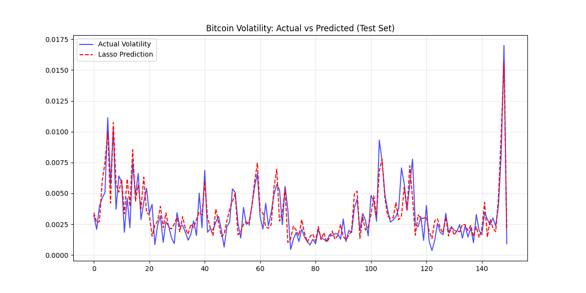

# Cryptocurrency Volatility Forecasting using Regularized Regression

## Project Summary

This project demonstrates a data-driven approach to forecasting short-term price volatility for the BTC/USD pair. Using time-series market data sourced directly from the Bitfinex API, this analysis employs and compares **Lasso (L1)** and **Ridge (L2)** regularized regression models to identify key predictive signals and build a robust forecasting model. The model achieves a strong **R² of 0.81** on unseen test data, confirming the hypothesis that future volatility is predictable from recent market dynamics.
 
---

## Key Skills & Technologies

*   **Data Ingestion:** Python (`requests`) for sourcing live time-series data from the Bitfinex public API.
*   **Data Wrangling:** `Pandas` and `NumPy` for data cleaning, preprocessing, and chronological sorting.
*   **Feature Engineering:** Created over 10 financial indicators and dynamic features (e.g., ATR, RSI, `abs_log_return`) using the `TA` library to capture market dynamics.
*   **Exploratory Data Analysis (EDA):** `Matplotlib` and `Seaborn` for visualizing feature relationships, identifying non-stationarity, and uncovering phenomena like volatility clustering.
*   **Advanced Regression:** Implemented and compared `scikit-learn`'s **LassoCV** and **RidgeCV** models to handle multicollinearity, perform automatic feature selection, and prevent overfitting.
*   **Model Validation:** Employed a rigorous **chronological train-test split** and **VIF (Variance Inflation Factor)** analysis to ensure the model's real-world predictive performance and statistical validity.
*   **Interpretability:** Analyzed model coefficients to derive actionable insights into the key drivers of market volatility.

---

## Problem Statement & Hypothesis

### Problem
Predicting the *direction* of cryptocurrency price movements is notoriously difficult and often statistically insignificant. However, predicting the **magnitude of price movement (volatility)** is a more tractable and highly valuable problem. Accurate volatility forecasts are critical for:
- **Risk Management:** Adjusting position sizes or pausing trading during predicted high-turbulence periods.
- **Strategy Development:** Creating algorithms that capitalize on volatility (e.g., straddle strategies).
- **Derivatives Pricing:** Informing the pricing of options and other financial instruments.

### Hypothesis
The volatility in the next 30-minute candle, represented by its price range, can be accurately predicted by a combination of recent price action, trading volume, and market momentum indicators.

---

## Methodology

### 1. Data Collection
- **Source:** Bitfinex API v2
- **Asset:** BTC/USD
- **Timeframe:** 30-minute candles (`30m`)
- **Data Points:** 1,428 candles (~30 days of data)
- **Target Variable (`y`):** The `price_range` of the *next* candle, calculated as `(High - Low) / Close`. This serves as a proxy for realized volatility.

### 2. Feature Engineering & Selection
From the raw OHLCV data, several predictive features were engineered:
- **Volatility Indicators:** `price_range` (current), `ATR(14)`
- **Momentum Indicators:** `RSI(14)`
- **Dynamic Price Features:** `log_return`
- **Volume Features:** `Volume`, `log_vol`

EDA revealed classic non-linear relationships (e.g., 'V-shape' for log returns vs. volatility). To linearize these for the regression models, new features were created:
- `abs_log_return`: Absolute value of the log return.
- `abs_rsi`: Absolute distance of RSI from its neutral midpoint of 50.

Finally, VIF analysis was used to diagnose and mitigate multicollinearity, leading to a final, robust set of features.

### 3. Modeling
1.  **Data Split:** The data was split **chronologically** into an 80% training set and a 20% test set to simulate real-world forecasting and prevent lookahead bias.
2.  **Scaling:** Features were standardized using `StandardScaler` to ensure the regularization penalties were applied fairly.
3.  **Regularization:** `LassoCV` and `RidgeCV` were used to train the models. The `CV` (Cross-Validation) component automatically finds the optimal regularization strength (alpha) based on the training data.

---

## Results & Interpretation

The models demonstrated strong predictive performance on unseen test data.

| Model | R² Score | Best Alpha | Test MSE |
| :--- | :--- | :--- | :--- |
| **Lasso** | **0.810** | 8.28e-06 | 1.07e-06 |
| **Ridge** | **0.811** | 0.0001 | 1.07e-06 |

### Key Insights from Lasso Coefficients
Lasso regression effectively performed automatic feature selection, providing clear insights into the drivers of volatility:

| Feature | Coefficient | Interpretation |
| :--- | :--- | :--- |
| **`abs_log_return`** | `0.00148` | **Most Important Predictor.** Large price movements (in either direction) are highly indicative of future volatility. |
| **`price_range`** | `0.00033` | Strong signal from "volatility clustering." A volatile current period suggests a volatile next period. |
| **`ATR`** | `0.00032` | Confirms the importance of recent volatility history. |
| **`log_vol`** | `0.00009` | Positive, but weaker signal. Higher volume is slightly associated with higher volatility. |
| **`abs_rsi`** | `-0.00004` | A weak negative signal, suggesting that as the market moves away from a neutral RSI, volatility tends to decrease slightly. |

## Future Work

- **Advanced Models:** Implement tree-based models like **XGBoost** or **Random Forest** to capture more complex, non-linear relationships.
- **Expanded Feature Set:** Incorporate more sophisticated technical indicators and macroeconomic data.
- **Alternative Target:** Reframe the problem as a **classification task** (e.g., predicting "high" vs. "low" volatility regimes) using Logistic Regression.
- **Sentiment Analysis:** Integrate social media sentiment data (e.g., from Twitter) as a predictive feature to test its impact on market volatility.
